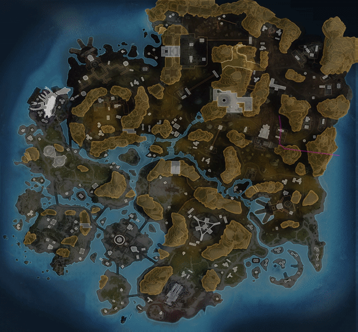

MiniMap Plotter
===============

The MiniMap Plotter is a Python tool for tracking player movement using a minimap screenshot sequence. It's ideal for game data analysis and enhancing player experiences through behavioral data.

  

Features
--------

*   Multiprocessing for optimized performance
*   Uses OpenCV's SIFT (Scale-Invariant Feature Transform) for feature mapping
*   BFMatcher (Brute Force Matcher) used for keypoint matching
*   Homography to match key points between images
*   Polygon size validation with a rolling average tolerance
*   Stores results in a CSV file
*   Real-time display of the movement tracking on the map

Prerequisites
-------------

*   Python 3.6 or later
*   OpenCV
*   Matplotlib
*   Numpy

Installation
------------

1.  Clone the repository

        git clone https://github.com/YourGithubUsername/MiniMap-Plotter.git

2.  Navigate into the cloned repository

        cd MiniMap-Plotter

3.  Install the requirements

        pip install -r requirements.txt

Usage
-----

You can run the MiniMap Plotter with the following command:

    python miniMapPlotter.py -mapName=<MAPNAME> -ratio=<RATIO>

Where:

*   `<MAPNAME>` is the name of the map you want to use. The valid names are 'KC', 'WE', 'OLY', 'SP', 'BM'.
*   `<RATIO>` (optional) is the aspect ratio of the map. The valid ratios are '4by3' (default), '16by9', '16by10'.

**IMPORTANT**

In order to use the program, you must run mapDataPacker.py to generate the baked keypoints. You only need to do this once, but it could take as long as an hour to complete. You can run the mapDataPacker with the following command:

    python mapDataPacker.py -mapName=<MAPNAME> -ratio=<RATIO>

Where:

*   `<MAPNAME>` is the name of the map you want to use. The valid names are 'KC', 'WE', 'OLY', 'SP', 'BM'.
*   `<RATIO>` is the aspect ratio of the map. The valid ratios are '4by3', '16by9', '16by10'.

Example
-------

Here is an example of how to run the program with the map named 'WE' and the ratio '4by3':

    python miniMapPlotter.py -mapName=WE -ratio=4by3

  

Results
-------

The results are stored in a CSV file with columns `Image Number`, `X`, and `Y` that record the player's coordinates on the map at each minimap screenshot.

Additionally, the final tracked path is plotted on the map and saved as an image.
